# RepoMind 🧠

> **Turn any GitHub repository into a living engineering ecosystem.**
> Paste a URL. Get security audits, architecture maps, DevOps signals, and an AI that *knows* your codebase — all in one polished workspace.

<div align="center">


[](https://python.org)
[](https://fastapi.tiangolo.com)
[](https://nextjs.org)
[](https://build.nvidia.com)
[](https://qdrant.tech)

</div>

---

## What is RepoMind?

RepoMind is a **multi-agent RAG platform** that ingests any GitHub repository and transforms it into an interactive intelligence layer. It is not a code search tool. It is not a simple chatbot. It is a full engineering cockpit — combining vector retrieval, a knowledge graph, four specialized AI analyzers, and a multi-agent orchestrator — all surfaced through a focused, fast frontend.

You paste a GitHub URL. RepoMind clones it, parses every file, chunks and embeds the codebase into Qdrant, builds a knowledge graph of its architecture, runs four specialized analyzers, and exposes everything through a chat interface powered by NVIDIA NIM. In under a minute, you can ask questions that would take hours to answer by reading code manually.

---

## Screenshots

| | |
|---|---|
| 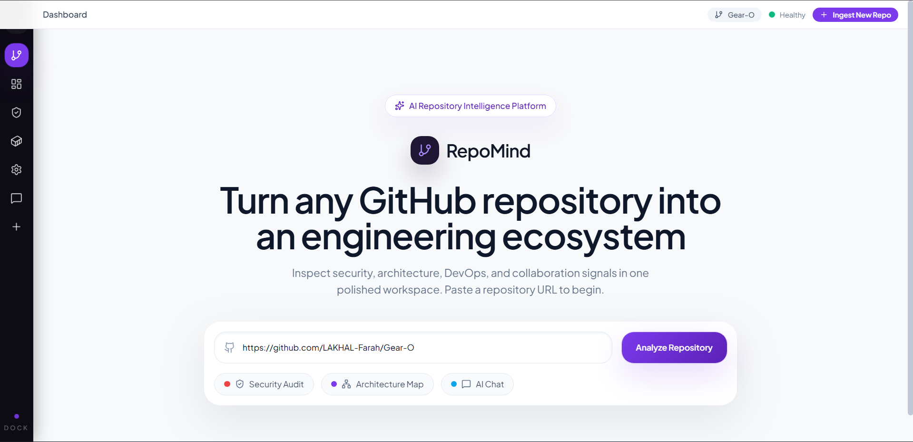 | 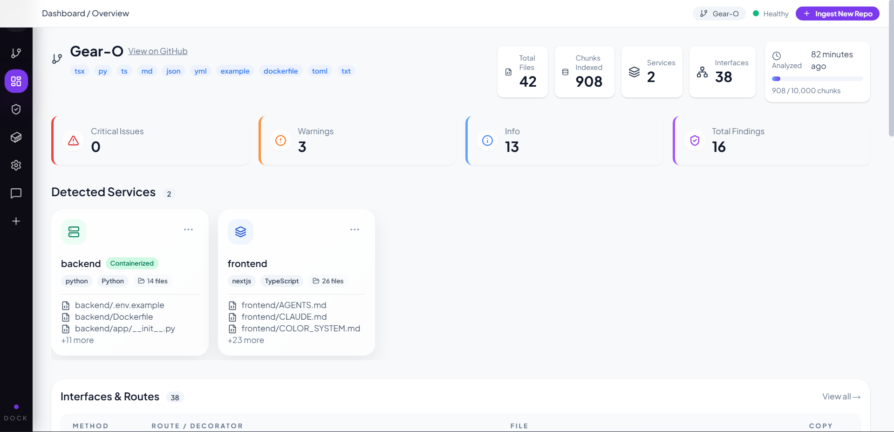 |
| *Paste any GitHub URL to begin ingestion* | *Overview: services, findings, interfaces at a glance* |
| 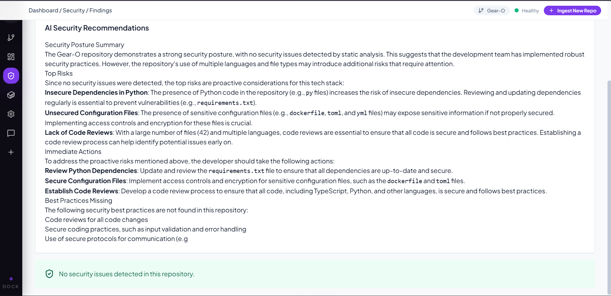 | 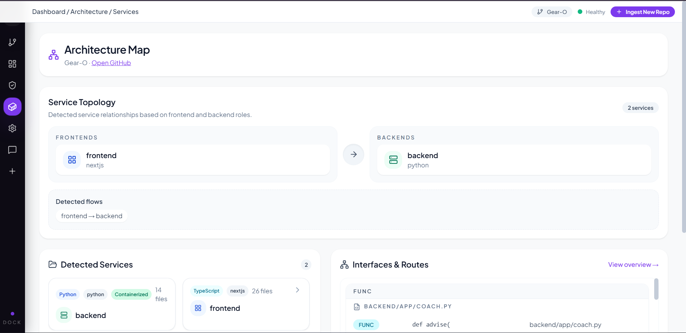 |
| *AI-rendered security analysis with severity tiers* | *Service map with detected APIs and file boundaries* |
| 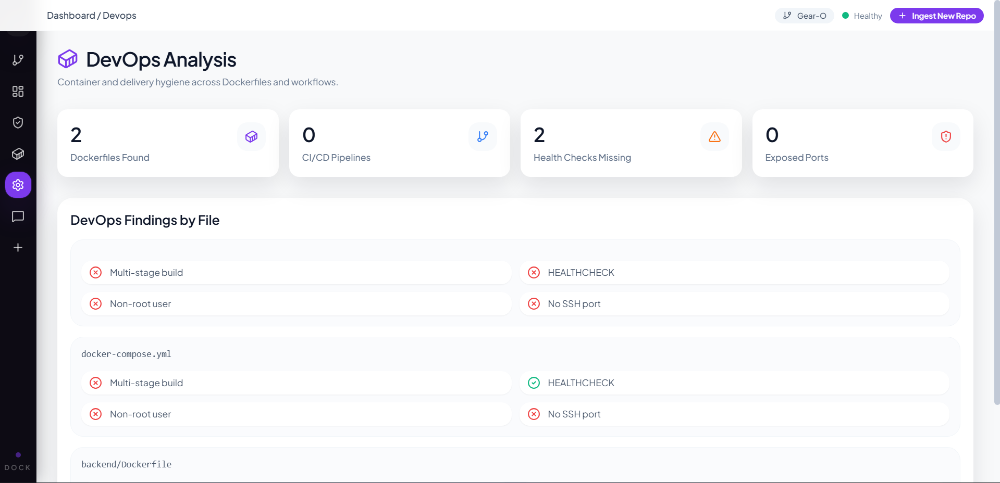 | 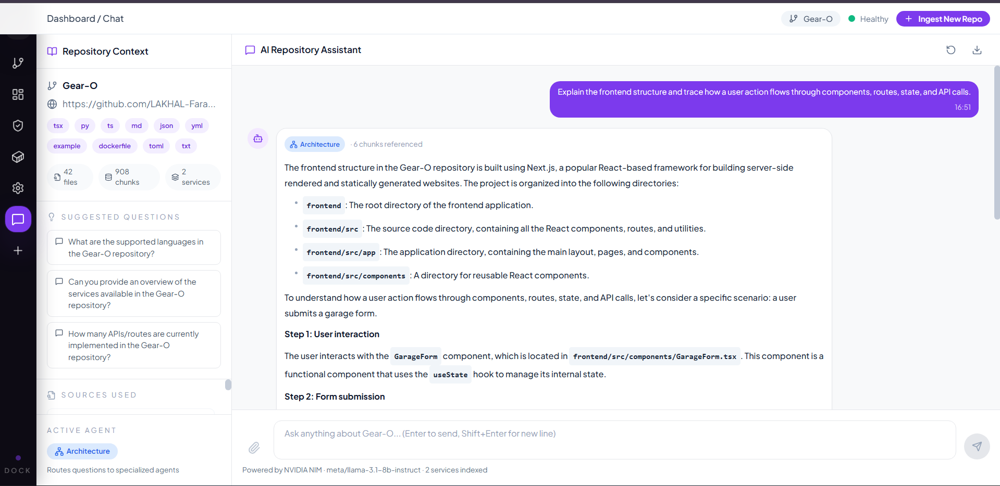 |
| *Docker, CI/CD, and deployment signal detection* | *Repo-aware chat: DevOps agent & Architecture agent modes* |

---

## How It Works — The Full Pipeline

### 1. Ingestion Pipeline

When you submit a repository URL, the ingestion pipeline runs end-to-end before the first byte hits the frontend.


### 2. The Four Analyzers

After ingestion, four independent static analyzers run in parallel against the parsed repository structure. Each returns a typed `List[Finding]` with severity, category, title, and detail.


### 3. The Multi-Agent Orchestrator

The chat interface is powered by a multi-agent system. When you ask a question, the orchestrator classifies it and routes it to the correct specialized agent. Each agent retrieves relevant chunks from Qdrant using semantic search, combines them with knowledge graph context, and sends a grounded prompt to NVIDIA NIM.

The chat interface exposes both the DevOps agent and the Architecture agent as selectable modes, so you can switch context mid-conversation without starting a new session.

---

### 4. System Architecture — Full Stack


## RAG Architecture Deep Dive

RepoMind implements **repository-scoped Retrieval Augmented Generation**. Here is why each design decision matters:


**Why this produces grounded answers:**
- Chunks are retrieved by semantic similarity, not keyword match — so "hardcoded credentials" finds `os.environ.get("SECRET")` patterns even without the word "secret"
- Every chunk carries `source_file` metadata, so citations are always real file paths from the actual repository
- The knowledge graph adds structural facts (which service owns which files) that pure vector search cannot infer
- NVIDIA NIM receives a prompt that is bounded by actual retrieved evidence — it cannot hallucinate file paths that were not in the top-k results

---

## Tech Stack

| Layer | Technology | Role |
|---|---|---|
| **Ingestion** | `gitpython`, Tree-sitter file walkers | Clone, parse, detect structure |
| **Chunking** | LangChain `RecursiveCharacterTextSplitter` | Code-aware splitting with overlap |
| **Embeddings** | `sentence-transformers` (all-MiniLM-L6-v2) | Dense vector encoding, 384 dims |
| **Vector Store** | Qdrant | Semantic search scoped by `repo_id` |
| **Knowledge Graph** | Neo4j + Cypher | Service → File → API relationship graph |
| **LLM** | NVIDIA NIM (OpenAI-compatible) | Grounded answer generation |
| **Backend** | FastAPI + Pydantic | Typed REST API, async routes |
| **Frontend** | Next.js 14, TypeScript, Tailwind CSS | Polished dashboard + chat UI |
| **State** | Zustand | Lightweight global repo context |
| **UI Components** | lucide-react, react-markdown | Icons + markdown rendering in chat |

---

## Project Structure

```
RepoMind/
├── ingestion/
│   ├── github_fetcher.py        # Clone / git pull any public GitHub URL
│   ├── repo_parser.py           # Service detection, API routes, Docker, CI/CD
│   ├── chunker.py               # Code-aware splitting (RecursiveCharacterTextSplitter)
│   └── embedder.py              # Embed → Qdrant, scoped by repo_id
│
├── knowledge_graph/
│   ├── graph_builder.py         # Neo4j: Repo → Service → File → API nodes
│   └── graph_queries.py         # Cypher helpers: services, APIs, summary
│
├── analyzers/
│   ├── base_analyzer.py         # Shared Finding dataclass + interface
│   ├── architecture_analyzer.py # Service boundaries, monolith signals
│   ├── security_analyzer.py     # Secrets, auth gaps, Dockerfile misconfig
│   ├── code_quality_analyzer.py # Test coverage, error handling signals
│   └── devops_analyzer.py       # Docker, pipelines, deployment assets
│
├── agents/
│   ├── orchestrator.py          # Routes questions to the right agent
│   ├── architecture_agent.py    # RAG + graph → architecture answers
│   ├── security_agent.py        # RAG + findings → security answers
│   └── devops_agent.py          # RAG + infra context → DevOps answers
│
├── api/
│   ├── main.py                  # FastAPI entrypoint
│   └── routes/
│       ├── ingest.py            # POST /api/ingest
│       ├── security.py          # GET + POST /api/security
│       ├── summary.py           # GET /api/summary
│       └── chat.py              # POST /api/chat
│
├── frontend/                    # Next.js app
│   ├── app/
│   │   ├── overview/            # Dashboard: findings, services, routes
│   │   ├── security/            # Security findings + AI recommendations
│   │   ├── architecture/        # Service map + file structure
│   │   ├── devops/              # Docker + pipeline signals
│   │   └── chat/                # Multi-agent chat with mode switching
│   └── components/              # Shared UI components
│
├── tests/
│   ├── test_parser.py
│   ├── test_ingestion.py
│   └── test_agents.py
│
├── main.py                      # CLI entrypoint
├── config.py                    # All env vars and constants
└── requirements.txt
```

---

## Getting Started

### Prerequisites

- Python 3.11+
- Node.js 18+
- Qdrant running locally (`docker run -p 6333:6333 qdrant/qdrant`)
- NVIDIA NIM API key ([get one free at build.nvidia.com](https://build.nvidia.com))

### Backend

```bash
python -m venv .venv
source .venv/bin/activate  # Windows: .venv\Scripts\activate
pip install -r requirements.txt
uvicorn api.main:app --reload --port 8000
```

### Frontend

```bash
cd frontend
npm install
npm run dev
```

Open [http://localhost:3000](http://localhost:3000) and paste any public GitHub URL to begin.

### Environment

Create a `.env` file in the project root:

```env
# NVIDIA NIM
NIM_API_KEY=your_key_here
NIM_BASE_URL=https://integrate.api.nvidia.com/v1
NIM_MODEL=meta/llama-3.1-70b-instruct

# Vector store
QDRANT_URL=http://localhost:6333
QDRANT_API_KEY=

# Knowledge graph (optional — falls back to in-memory if not set)
NEO4J_URI=bolt://localhost:7687
NEO4J_USER=neo4j
NEO4J_PASSWORD=your_password

# Embedding
EMBED_MODEL=all-MiniLM-L6-v2
CHUNK_SIZE=512
CHUNK_OVERLAP=64
```

---

## API Reference

| Method | Route | Description |
|---|---|---|
| `POST` | `/api/ingest` | Clone repo, parse, embed, build graph |
| `GET` | `/api/summary/{repo_id}` | Overview: files, services, chunk count |
| `GET` | `/api/services/{repo_id}` | Detected services with file lists |
| `GET` | `/api/security/{repo_id}` | Security findings (static analysis) |
| `POST` | `/api/security/analyze/{repo_id}` | Run AI security recommendations |
| `GET` | `/api/chat/suggestions/{repo_id}` | Suggested starter questions |
| `POST` | `/api/chat` | Multi-agent grounded Q&A |

---

## Frontend Pages

| Route | What it shows |
|---|---|
| `/` | Landing — paste a repo URL, trigger ingestion |
| `/overview` | Stats, detected services, interfaces & routes |
| `/security` | Severity-tiered findings + AI markdown recommendations |
| `/architecture` | Service map, file ownership, API surface |
| `/devops` | Docker assets, CI/CD pipelines, deployment signals |
| `/chat` | Multi-agent chat with DevOps and Architecture agent modes |

---

## Agent Routing Logic

The orchestrator classifies every question before routing it:

```
Question contains: "secret", "auth", "vulnerability", "CVE", "password", "token"
  → SecurityAgent

Question contains: "docker", "deploy", "pipeline", "ci", "cd", "kubernetes", "container"
  → DevOpsAgent

Question contains: "architecture", "service", "pattern", "structure", "api", "monolith"
  → ArchitectureAgent

Default fallback
  → ArchitectureAgent (broad codebase context)
```

Each agent builds its prompt from three sources:
1. **Semantic retrieval** — top-k chunks from Qdrant, filtered by `repo_id`
2. **Graph context** — services and APIs from Neo4j, injected as structured facts
3. **Analyzer findings** — relevant findings passed as additional grounding context

---

## Testing

```bash
# Backend unit tests
pytest tests/ -v

# Frontend linting
cd frontend && npm run lint

# Full end-to-end test (requires Qdrant + NVIDIA NIM)
python tests/test_e2e.py
```

The E2E test suite runs all 10 layers: clone → parse → chunk → embed → graph → analyze → route → chat → API → cleanup. No mocking. Every layer must be real.


## License

No license specified yet. All rights reserved.

---

<div align="center">

Built with [NVIDIA NIM](https://build.nvidia.com) · [Qdrant](https://qdrant.tech) · [FastAPI](https://fastapi.tiangolo.com) · [Next.js](https://nextjs.org)

*RepoMind — because reading code is slower than asking it questions.*

</div>
